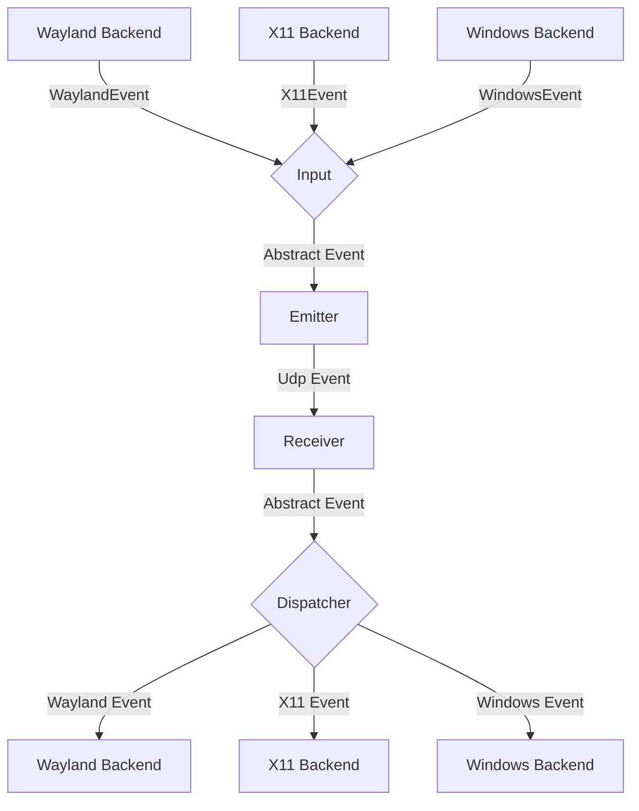

# General Software Architecture

## Events

Each instance of mousehop can emit and receive events, where
an event is either a mouse or keyboard event for now.

The general Architecture is shown in the following flow chart:


### Input
The input component is responsible for translating inputs from a given backend
to a standardized format and passing them to the event emitter.

#### macOS receiver keyboard injection

On macOS the receiving side posts forwarded keyboard input as HID-level events:
modifier transitions go out as `NX_FLAGSCHANGED` through `IOHIDPostEvent` with
the physical key code of the side that changed plus the matching general and
device-dependent flag bits, and ordinary keys as `NX_KEYDOWN`/`NX_KEYUP` with no
global flags. This supports Control+Left/Right Arrow desktop switching, which
did not work with the previous `CGEvent` injection path in our Mac tests.

`input-emulation/src/macos_keyboard.rs` holds the platform-independent half: the
side/flag model, side aggregation, default-side materialisation for snapshots
that name no side, release planning and the fallback policy. It is compiled for
test targets on every platform. `input-emulation/src/nx_key_bridge.c` contains
the only SDK `NXEventData` construction and the only `IOHIDPostEvent` call,
to isolate the macOS SDK types and the API deprecated since macOS 11.

`IOHIDPostEvent` replaces the whole global modifier state, so the backend merges
the remote snapshot with observed session flags. These flags include synthetic
input, so simultaneous local and remote presses of the same modifier side
cannot be distinguished reliably. If the IOHID path
is unavailable or fails, the backend records the error, releases the input it
already injected (retrying once through `CGEvent`), and only then continues on
the `CGEvent` fallback, which types text but does not guarantee macOS system
shortcuts. A release that fails on both paths is propagated as an emulation
error: the emulation session stops instead of silently holding the key, and
its shutdown cleanup retries the release.

##### macOS keyboard diagnostics

Detailed keyboard logs are disabled by default. To troubleshoot the receiving
Mac, quit Mousehop first and launch its executable with:

```sh
MOUSEHOP_LOG_LEVEL='mousehop::keyboard=debug,info' \
  /Applications/Mousehop.app/Contents/MacOS/mousehop > keyboard.log 2>&1
```

Logs report permission checks, injection path, modifier transitions, arrow
events, failures and cleanup. `submitted` means the OS API accepted an event,
not that a shortcut ran. Ordinary character keycodes and text are omitted.
Warnings remain in the normal connection logs; debug output requires explicit
redirection as above. No separate diagnostic application is required.

### Emitter
The event emitter serializes events and sends them over the network
to the correct client.

### Receiver
The receiver receives events over the network and deserializes them into
the standardized event format.

### Dispatcher
The dispatcher component takes events from the event receiver and passes them
to the correct backend corresponding to the type of client.


## Network transport

Peer events and control messages use authenticated DTLS connections over UDP.
There is no separate TCP connection-request protocol in the current data path.
Each accepted or outbound connection has its own local session generation.

Each outgoing client's `use_kcp` setting is controlled in Outgoing Connections.
Changing it releases that peer's capture and reconnects only that peer. Incoming
connections automatically follow the authenticated controller's selection.
The old top-level `input_transport` supplies a default only when a client lacks
an explicit `use_kcp`; explicit false survives saving. Legacy remains the default.
KCP negotiates a message channel inside the same DTLS connection and never downgrades.
Hello, Ping/Pong and clipboard stay direct. With both peers on 0.17.7 or newer,
pointer motion also uses direct encrypted UDP; keyboard, buttons, scrolling and
handover/control events share the reliable channel. Cumulative motion and
reliable checkpoints preserve displacement and critical-event ordering. Older
KCP peers retain the all-reliable input channel. Existing business
acknowledgements remain required.

Transport support bit `1 << 2`, controller request bit `1 << 3`, reserved tag 240
and transport version 2 identify the extension without renumbering existing event
tags. Capability alone does not select KCP. A repeated Hello cannot change the
mode of an established session. Legacy controllers retain the old wire format;
the experimental version-1 KCP build must be upgraded on both sides. Offer/Ready
bind a negotiation ID and KCP conversation to the DTLS session. Data frames
include the negotiation ID, and progress frames report cumulative sent and
business-consumed sequence numbers. KCP ACKs alone do not certify consumption.
The top-level `kcp_stall_timeout_ms = 600` setting (integer milliseconds,
1..=60000, default 600) is validated when loading configuration and preserved
when saving it. Invalid TOML settings now fail startup rather than silently
falling back to defaults; invalid live reloads retain the previous configuration.
The service snapshots the timeout at startup for both connection managers,
including future reconnects and listener rebinds. File reloads do not change the
running policy: restart each host after editing its file. There is no wire
negotiation of this value; increasing one host's timeout cannot delay the other's.
This input policy covers sent-but-unconsumed input, local consumption,
the receive gap, KCP DTLS writes and consumption receipts. Remaining receive-gap
age restarts only when the contiguous application receive watermark advances;
catching up clears it. Bootstrap, ACK-only, duplicate or buffered out-of-order
data and Progress alone cannot renew it. Legacy keeps its previous I/O policy.
Peer liveness uses a separate top-level `kcp_peer_timeout_ms = 3000` setting,
also integer milliseconds in 1..=60000, startup-snapshotted on both sides.
Fresh negotiated motion, valid KCP traffic and authenticated Ping/Pong renew only
this liveness clock. Established KCP sessions bypass the Legacy fixed heartbeat
and receive-idle watchdogs, so they cannot override the configured peer deadline.
Longer peer deadlines also delay releasing already-held input after total silence.
Independent bounds remain: 6s transport negotiation, 300ms close cleanup, fixed
queue/window budgets and the existing business handshake timeouts.

Outgoing `ClientConfig.scroll_inertia` defaults to false and is persisted per
device. The controller's authenticated Hello sets preference bit `1 << 4` only
when enabled; KCP's Hello wrapping preserves it. The receiver scopes the opt-in
to the current DTLS session and supplies it to receive post-processing. On a
non-macOS receiver, default-off drops source momentum, while opt-in forwards the
original deltas through the existing natural-scroll transform and OS backend.
No event tag or existing wire layout changes; older peers ignore the new bit.
The new IPC preference defaults to false when absent. Toggle changes use the
same release barrier and targeted reconnect as the outgoing KCP switch, without
affecting other devices. Both peers must be updated for this preference to work.
Resource violations close the session. Negotiated input/queue-age stalls enter
recovery; older KCP peers still close. See [reliable input configuration](README.md#experimental-reliable-input-over-dtls)
for timeout settings, transport behavior and experimental limitations.

## Local input recovery barrier (0.17.12)

`InputEmulation::recovery_barrier(handle)` stops and joins background input,
releases tracked keys, buttons and modifiers, and returns an actual absolute
cursor position with display geometry. Failed releases remain tracked for retry;
post-processing preferences survive cleanup. Windows `SendInput` attempts each
event once and propagates rejection instead of spinning indefinitely. Windows
repeat tasks are owned by individual handles and cancellation is joined.

`EmulationProxy::recovery_barrier` retires the previous session/epoch token
immediately and queues cleanup on an independent bounded management channel.
It runs after any already-started backend call finishes; cancelling the caller's
wait does not cancel that OS operation. Success prepares a new token; the
transport driver confirms installation before opening receive gates, then uses
`consume_epoch` for every input. Retry callers retain the original completion;
duplicate or older epochs are rejected. Legacy `Barrier` still only acknowledges
queue consumption. Legacy input/warp requests cannot bypass a managed token.

Windows incoming connections advertise recovery only after the Windows backend
is available and its actual cursor baseline can be read. `recovery_available()`
performs this read-only probe; denied desktop access leaves capability disabled.
macOS and other receiving backends return `RecoveryUnsupported` until their
per-handle background-task and cursor-baseline guarantees are implemented.
Windows currently reports virtual-screen bounding geometry, not individual
monitor contours. A hung backend keeps the gate closed: the driver enforces its
hard deadline and arranges delayed cleanup without cancelling the serial backend
worker. Mac outgoing capture participates without invoking a local emulation
barrier or injecting a dummy cursor baseline into the OS.

## Same-connection recovery protocol (0.17.12)

`mousehop_proto::transport::recovery` defines capability bit 6 and an independent
tag-242/version-1 envelope. Recovery requires both peers' capability and selected
KCP. Existing reliable Frame v2 and Motion v1 encodings are unchanged. The outer
header carries a 128-bit nonzero session identifier, u64 input epoch, and sender
role. It wraps reliable frames (including Progress), UDP motion, or an independent
recovery control. Maximum encoded size is 1141 bytes; controls are 29 or 70 bytes.
The baseline is a finite bounded actual cursor position, nonzero layout generation,
confirmed ownership digest, and owner role. The driver must generate a fresh
session identifier for each authenticated DTLS association and verify ownership
and layout against its application state; a digest is not proof by itself.

`transport::recovery::Recovery` is a deterministic, local-monotonic-ms state
machine. The dialer coordinates one `e -> e+1` round; either side may trigger it.
`step(now, Input)` produces an immutable outcome with at most one outbound control,
a barrier or install token, a peer baseline, and a close reason. Request/Prepare/
Prepared/Commit/CommitAck/Activate/ActivateAck bypass the blocked input channel.
The driver must send these via its existing single DTLS writer. It coalesces
repeated barrier/install tokens and prioritizes control over frozen data.

`Barrier` completion means old injection is isolated and keys/background work
are released, not merely that a request was queued. `Installed` completion means
the new KCP, cumulative-motion zero point, receipts and receive consumer are ready.
Only then does the receive gate open. The acceptor sends after Activate and the
dialer sends after ActivateAck, so both receive gates precede the opposite send
gate. `send_epoch(now)` / `receive_epoch(now)` and `accepts_data(now, envelope)`
must be checked immediately before use and again after awaits. Controls enter
`step(Control)` separately. Unknown-result old actions are never a replay source.

The recovery deadline is 2000 ms from first local entry, checked on every event
including backend callbacks, independently of peer liveness. Gate queries also
check expiry even without a tick. Periodic retries are 50 ms; duplicate requests
cannot reset this timer or the hard deadline. One previous terminal response is
cached to repair lost final acknowledgements without another freeze/release.
Only explicitly validated current-session activity may call `PeerActivity`;
old-round controls do not refresh liveness. Close reasons require the driver to
perform safe return and independent/delayed backend cleanup.

The driver generates the 128-bit session with the TLS provider's secure RNG. The
acceptor learns it only from the negotiated first-epoch Offer. Every subsequent
reliable/motion packet validates session, epoch and role, including normal input.
All application input deliveries, including UDP motion, carry a generation guard;
retiring it invalidates receipts and backend tokens immediately. The full session
identity is preserved through EmulationProxy, separately from the KCP conversation.

After CommitAck and local installation, the dialer sends a new-epoch KCP bootstrap
probe before Activate. Only the probe's KCP acknowledgement completes this step;
heartbeat or Progress alone cannot do so. The acceptor's prepared receive gate
permits transport acknowledgements but its input sender remains frozen. Business
input cannot bypass the activation gates. This prevents healthy control traffic
from masking a permanently broken reliable input path.

Capture continuously drains physical events while frozen, suppresses held keys,
buttons, repeats and modifier snapshots until release, and discards paused motion
and scrolling. A bounded drain precedes activation. Actual Windows cursor and
layout fingerprints rebase the sender's model, including negative monitor origins;
no local or remote cursor warp is performed by recovery. Confirmed handover serial
and owner form the ownership digest; unconfirmed transitions fail safely.

The default policy is 600/2000/3000 ms: input stall / fixed recovery / peer silence.
Only stall and peer values are configurable. Legacy I/O and close cleanup retain
their separate 300 ms constants. Negotiated recovery bypasses Legacy watchdogs
and the receiver's independent 1-second ownership timeout. Actual DTLS I/O errors,
permanent writes, integrity violations, resource exhaustion and unsafe backends
still fail closed. Tests do not establish two-machine or field acceptance.

## Problems

The general Idea is to have a bidirectional connection by default, meaning
any connected device can not only receive events but also send events back.

This way when connecting e.g. a PC to a Laptop, either device can be used
to control the other.

It needs to be ensured, that whenever a device is controlled the controlled
device does not transmit the events back to the original sender.
Otherwise events are multiplied and either one of the instances crashes.

To keep the implementation of input backends simple this needs to be handled
on the server level.

## Device State - Active and Inactive
To solve this problem, each device can be in exactly two states:

Either events are sent or received.

This ensures that
- a) Events can never result in a feedback loop.
- b) As soon as a virtual input enters another client, mousehop will stop receiving events,
which ensures clients can only be controlled directly and not indirectly through other clients.

